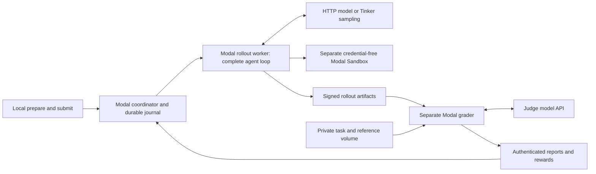

# Remote research episodes and grading

Modal runs the coordinator, complete research loops, repository tools, and grading workers. Tinker supplies policy sampling when selected. The laptop prepares/uploads inputs and submits a detached remote call; it is not a rollout worker and does not need to remain connected.



The generic `AgentRunner`, tool registry, model contract, and coordinator executor interface remain independent of Modal. Modal-specific deployment is in `agent_harness.modal_app`. Code understanding and the existing QA evaluator are the initial remote adapters.

## Install and deploy

Use Python 3.11+ locally, Git, and a configured Modal account:

```bash
python3 -m pip install -e '.[remote]'
python3 -m modal setup
```

Create these named secrets through Modal's dashboard or secret management tooling. Replace `agent-harness` with your `HARNESS_APP` name if customized. Keep values out of batch JSON and repository files.

| Secret | Values |
| --- | --- |
| `agent-harness-policy` | `AGENT_API_KEY` for HTTP sampling, or `TINKER_API_KEY` for Tinker |
| `agent-harness-telemetry` | `HARNESS_TELEMETRY_KEY`: a random hex-encoded key of at least 32 bytes |
| `agent-harness-grader` | A distinct `HARNESS_GRADER_KEY` with the same format; judge configuration below |

For the HTTP judge adapter, the grader secret contains `QA_TRAIN_JUDGE_BASE_URL`, `QA_TRAIN_JUDGE_MODEL`, and `QA_TRAIN_JUDGE_API_KEY` for training, and corresponding `QA_EVAL_JUDGE_*` values for evaluation. Configure the roles you will use. URLs include the API prefix, such as `/v1`; model names and judge families must match the frozen experiment. Optional `QA_JUDGE_TIMEOUT` controls each HTTP judge request.

Deploy HTTP sampling support:

```bash
python3 -m modal deploy -m agent_harness.modal_app
```

To include Tinker sampling dependencies in the remote image:

```bash
HARNESS_INCLUDE_TINKER=1 python3 -m modal deploy -m agent_harness.modal_app
```

The optional local extra `.[tinker]` installs the same pinned adapter dependencies for local development. Remote images install them when `HARNESS_INCLUDE_TINKER=1`; local Tinker installation is not needed to submit JSON jobs. Pins are `modal==1.5.5`, `tinker==0.30.4`, and `tinker-cookbook==0.5.7`. The Tinker image is larger because cookbook dependencies include training libraries.

Set `HARNESS_APP=your-app` on deployment and pass `--app your-app` to remote CLI commands. Deployment creates five app-specific Volumes: public inputs, private grading inputs, rollouts, grades, and coordinator state.

## Prepare and submit a batch

Start from existing schema-valid QA task and frozen experiment JSON files. Each task must appear with its exact task hash in the experiment manifest. Use absolute input paths; preparation reads paths relative to the current working directory.

Example HTTP batch configuration:

```json
{
  "run_id": "research-dev-001",
  "model": {
    "kind": "http",
    "model": "YOUR_EXPLICIT_MODEL_VERSION",
    "base_url": "https://YOUR_PROVIDER/v1",
    "input_price_per_million": 1.0,
    "output_price_per_million": 2.0
  },
  "episodes_per_task": 4,
  "max_rollouts": 4,
  "max_graders": 2,
  "coordinator_seconds": 3600,
  "limits": {
    "max_steps": 30,
    "max_tool_calls": 25,
    "max_output_tokens": 16000,
    "wall_time_seconds": 300,
    "max_context_chars": 64000
  },
  "tasks": [
    {
      "task": "/ABSOLUTE/PATH/task.json",
      "experiment": "/ABSOLUTE/PATH/experiment.json",
      "repository": "/ABSOLUTE/PATH/repository",
      "role": "evaluation"
    }
  ]
}
```

Replace the sample token prices with your provider's actual configured rates. Both prices and provider token usage are needed for signed cost metrics; missing usage stays unknown and can make grading unresolved. Prices are estimates, not invoices, and exclude Modal compute and judge costs. Model, wall-time, and concurrency limits bound work but are not a dollar spending cap.

For Tinker, replace `model` with this configuration, selecting an explicitly supported model and matching native tool-capable renderer:

```json
{
  "kind": "tinker",
  "base_model": "YOUR_EXPLICIT_BASE_MODEL",
  "renderer_name": "YOUR_MATCHING_COOKBOOK_RENDERER",
  "temperature": 1.0,
  "input_price_per_million": 1.0,
  "output_price_per_million": 2.0
}
```

Optional `model_path` selects an exact `tinker://...` sampling checkpoint; it never falls back to base weights. Optional `seed` reproducibly derives a distinct seed for each episode within a task group; omit it for unseeded stochastic rollouts. Renderer names are explicitly configured because tool templates depend on the model. Tinker credentials stay in the policy secret.

```bash
agent-harness-remote prepare --config batch.json --output /tmp/research-bundle
agent-harness-remote submit --bundle /tmp/research-bundle --app agent-harness
```

`prepare` performs no sampling or cloud execution. It validates the task/experiment, builds hashed Git bundles at pinned commits, and writes separate `public/` and `private/` directories. Choose a new output directory and unique run ID. Do not place private grading inputs inside the researched repository: a Git bundle carries repository history reachable from its commit.

`submit` uploads the separated inputs and starts the deployed coordinator with a detached call. Save the returned call ID. No execution manifest means read/search tools only. To enable tests/probes, add `environment_manifest` to the task entry, pointing to a ready Modal execution environment built for that exact task commit and source hashes.

Use `role: "training"` only for train-split tasks. Scripted actions and preloaded semantic judgments are supported only for explicitly synthetic smoke batches; they are not model-quality measurements.

## Monitor, retrieve, and recover

```bash
agent-harness-remote status --call-id fc-YOUR_CALL_ID
agent-harness-remote inspect --run-id research-dev-001 --app agent-harness
agent-harness-remote resume --run-id research-dev-001 --app agent-harness
agent-harness-remote download --run-id research-dev-001 --app agent-harness --output /tmp/research-results
```

`status` checks the remote coordinator call; `inspect` reads its persisted journal and compact episode/group status. `download` retrieves run-specific rollout artifacts, grade artifacts, and coordinator state. Private references are kept in their separate input Volume.

The coordinator independently bounds rollout and grader concurrency and applies backpressure when graders lag. Defaults belong to the batch: deployment ceilings are 32 rollout containers and 16 grader containers. Each cohort supports up to 1,000 episodes. Each episode allows at most 3,600 seconds; coordinator batches at most 86,000 seconds. Increase concurrency only after checking provider rate limits and cloud cost.

Journal entries retain call IDs and manifest identity. `submit` uploads a new run and rejects existing upload paths. Use `resume` to start the coordinator against the already uploaded manifest and persisted journal; it resumes recorded calls without launching completed episodes again. A single coordinator container enforces one journal writer; separate deployments are appropriate for independently scheduled cohorts. Changed inputs require a new run ID. Each transition persists the full journal, so start with small cohorts and split large experiments into separate run IDs rather than putting an unbounded dataset in one batch.

A crash around submission can leave an uncertain remote-call identity. Such episodes become unresolved for operator recovery instead of being automatically retried and double-counted. Coordinator deadline expiry marks outstanding work unresolved and requests cancellation of active calls. Cancellation is best effort; if it fails, the worker timeout remains the fallback. Inspect recorded calls before launching replacements. Infrastructure failures and unresolved grades are not negative policy examples, and an unresolved member excludes the whole training group.

## Isolation, verification, and RL boundary

The rollout Function runs each episode in a subprocess so POSIX deadlines operate on the main thread. It can access public inputs, its policy credentials, and telemetry signing; it does not mount private grading inputs or receive the grader key. Repository test/probe code runs in separate Modal Sandboxes without these secrets or the worker's Volumes. Source tools read pinned Git blobs.

The grader is a separate Function with private reference inputs and grader credentials. It authenticates rollout identity and artifacts before calling the existing evaluator. The coordinator has no policy or grader secrets. Durable output hashes and authenticated reports prevent stale or substituted results from silently joining another run.

Production deployment is explicit; the verification workflow uses a separate synthetic smoke app. Offline tests and synthetic cloud smoke runs establish execution mechanics and isolation contracts. They do not establish real-model quality, judge calibration, production throughput, or successful paid Tinker sampling.

Run the reproducible cloud smoke from the repository after installing the remote extra:

```bash
python -m scripts.smoke_remote_harness --deploy --output /tmp/harness-smoke-fresh --app agent-harness-smoke
```

This deploys a separate app with ephemeral signing secrets, prepares four synthetic read-file/answer episodes, waits for remote grading, and verifies that completed-run resumption reuses the original calls. It makes no policy or judge API calls; Modal CPU and storage charges still apply. Use a fresh output directory. Redeploying this smoke app rotates its ephemeral signing keys; old smoke artifacts are retained but cannot be authenticated by the new keys.

Tinker sampling preserves exact conditioning token IDs, generated token IDs, and available sampling log probabilities per turn, including malformed/length-limited responses. Missing likelihoods are never fabricated. HTTP sampling lacks this exact training provenance and is unsuitable for direct policy-gradient updates.

This release does **not** update model weights. A future training orchestrator must load authenticated complete training groups, apply `qa_eval.rl.prepare_group`, build assistant-token-only losses from recorded turns, and call Tinker's `forward_backward`, `optim_step`, and checkpoint APIs. Evaluation and checkpoint promotion remain separate from this sampling/grading deployment.
