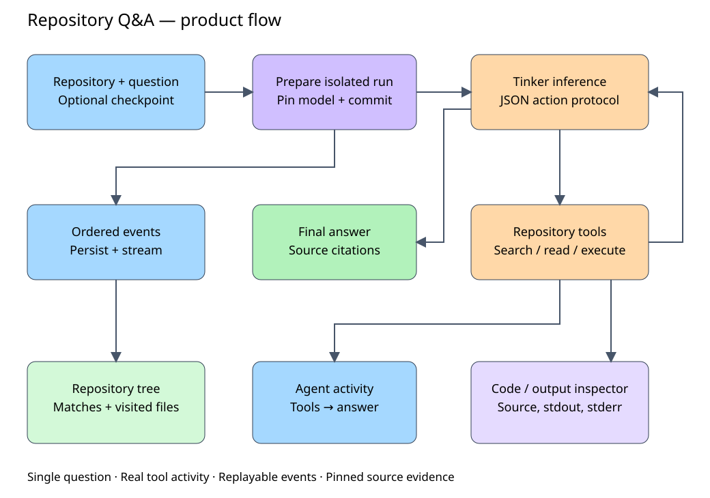

# Repository Q&A — product plan

Build a local web app where a user selects a pinned repository, asks one question,
optionally selects a project Tinker checkpoint, and watches the agent investigate
until it produces a cited answer.

## Flow reference

[Open the editable Excalidraw flow](diagrams/product-flow.excalidraw)

Select repository + question + model → prepare run → Tinker JSON action → execute
repository tool → return observation to model → repeat → final cited answer.
Throughout the loop, ordered events update the repository tree, activity timeline,
and code/execution inspector.

## Confirmed defaults

- Local React/TypeScript UI and Python API, one active question at a time.
- Qwen3.5-4B base model initially selected; discover project training checkpoints.
- Pydantic pinned dataset environment, including isolated Modal execution.
- Tree + code visualization; single-question runs, independent reruns.

## User experience

A compact setup bar holds repository and model selectors. The question composer
includes an editable example. The live workspace has a repository tree on the
left, tool activity and the final answer in the center, and source/output on the
right. Tool cards expose inputs, results, errors, duration, and execution output.
Clicking a citation opens the corresponding pinned lines. Auto-follow pauses
when the user inspects earlier evidence. Narrow screens use panel tabs.

Show actual tool activity, never invented reasoning or simulated token streaming.
Distinguish search matches, observed source ranges, and explicit execution targets.
Preserve the trace on success, failure, cancellation, and budget exhaustion.
Support reconnect, reload, and rerunning with another checkpoint.

## Implementation

- FastAPI serves the Vite build on localhost; credentials stay on the backend.
- One supervised subprocess per run preserves the harness's main-thread deadlines.
- Persist metadata, public JSONL events, answers, and artifacts locally. SSE supports
  ordered replay. Browser disconnect does not cancel the run.
- Reuse the bounded agent runner, repository tools, and fresh Modal sandboxes.
- Match project checkpoint renderer/template identity and its JSON action format.
  Version the product prompt to add capability-dependent execution tools; the
  training prompt previously prohibited execution.
- Reconcile local project checkpoint manifests with Tinker's paginated catalog;
  show unavailable/expired/training-only entries without silently using base weights.
- Validate environment source identity and citations; never expose private eval data.
- Public API: catalogs, create/read/cancel run, replayable events, pinned source,
  and run-scoped artifacts. One active run initially; no auth or arbitrary repo import.

## Validation

Test JSON action compatibility, checkpoint expiry/catalog pagination, ordered event
replay, cancellation, worker crashes, invalid citations, source path boundaries,
and execution failure. A deterministic fixture exercises search, read, execution,
and final answer in the browser. Real base/checkpoint smoke runs require configured
credentials; scripted output must be visibly labeled. Run existing harness tests,
frontend type/build checks, and browser checks for desktop and narrow layouts.

## Delivery order

1. Working base-model question → tool loop → cited answer.
2. Live tree, activity timeline, inspector, and execution output.
3. Checkpoint selection, recovery, cancellation, and lifecycle verification.

No follow-up chat, grading dashboard, multi-user hosting, or checkpoint comparison
in this release. The diagram is a design reference, not evidence of live inference.
